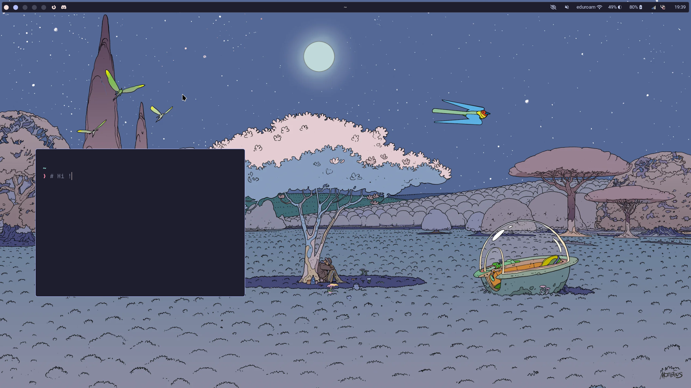

# NixOS Configuration

Hi :3 !!

This repo contains my [NixOS](https://nixos.org/) configuration. It should mostly work on your machine, except for some details which are in the `nixos` directory.

The whole configuration is a flake, and contains two outputs with small differences: one for my desktop computer and one for my laptop. You can test the flake with the following command :

```sh
nix run github:yopaman/nixos-config#desktop # adds KDE desktop + SDDM

# or

nix run github:yopaman/nixos-config#laptop # different nvidia config and no KDE
```

The main parts of my desktop configuration are :

- WM: [Niri](https://github.com/YaLTeR/niri)
- Bar: [Waybar](https://github.com/Alexays/Waybar)
- Launcher: [Anyrun](https://github.com/anyrun-org/anyrun)

## Screenshots



## Nix Resources

- nix.dev first steps: https://nix.dev/tutorials/first-steps/
- nix starter config: https://github.com/Misterio77/nix-starter-configs
- search home manager options: https://home-manager-options.extranix.com
- nix vim : https://nix-community.github.io/nixvim/


